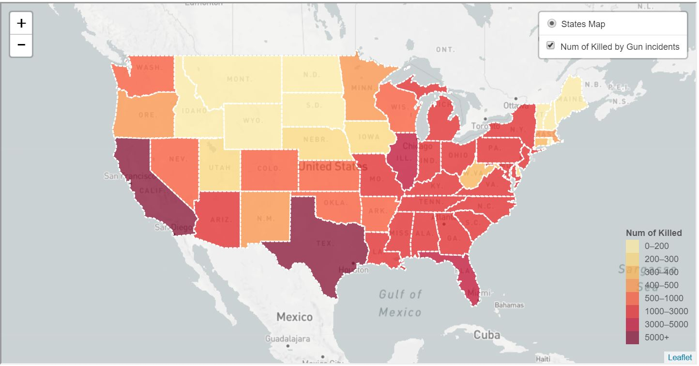
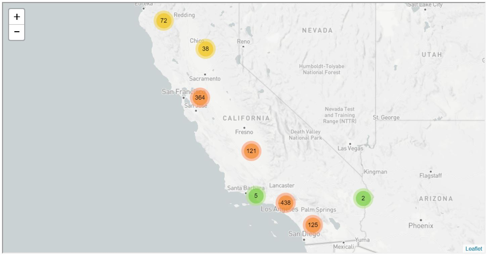
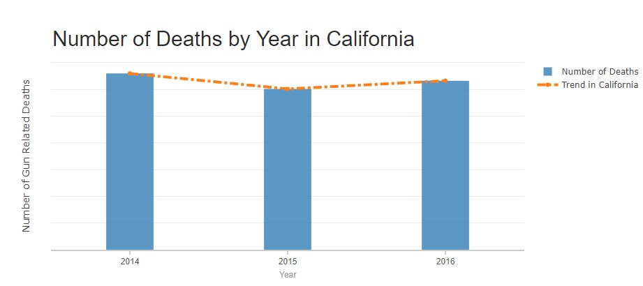

# Gun Violence in America
***
## Members:
* [Sue Hellen Del Carpio Bellido Vargas]
* [Cesar Castrejon]
* [Roger Tran]
* [Fahim]
* [Yoyo Wu]

### Project Proposal: 
#### Analyze data on gun related incidents in america by location and type.

### Topic: Gun Violence

#### Data Sources: 
* https://www.kaggle.com/jameslko/gun-violence-data/version/1#

#### Vizualizations: 
* 1st view: People killed by gun incidents.
This map includes the number of killed persons from 2014 to 2018-march

* 2nd view: People killed in California.
This map includes a cluster of markers. Each marker represents the exact position of the gun incident and the type of incident: Suicide, Mass Shooting, School Shooting, etc.

* 3rd view: Number of Gun Related Incidents by Type.

